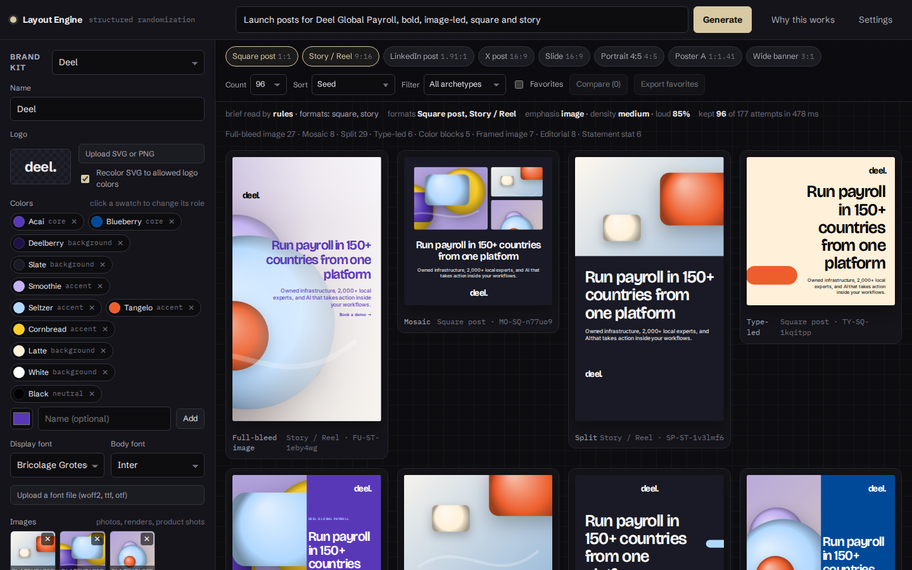

# Layout Engine

Structured randomization for brand layouts. Give it a brief and your brand assets, get up to 360 on-grid variations you can scan, compare, favorite, and export.

Then work on the results like in Paper or Figma: an infinite canvas with frames, multi-screen edits, Figma import, captured web pages, live multiplayer, and a design agent (in the app and over MCP).



## Run it

No build step. Open `index.html` from a local web server (fonts and exports need `http://`, not `file://`):

```bash
cd layout-generator
npx http-server -p 8123 .      # or: python3 -m http.server 8123
open http://127.0.0.1:8123/
```

Single-file build for sharing (produces `dist/layout-engine.html` for publishing and `dist/layout-engine.standalone.html` for opening anywhere):

```bash
node build.mjs
```

With the sync server (live multiplayer, shared images, and the MCP endpoint for agents). Node 18+, no dependencies:

```bash
cd layout-generator
npm start                      # http://127.0.0.1:8787
PORT=9000 npm start            # another port
HOST=0.0.0.0 LG_TOKEN=secret npm start   # reachable by others; MCP clients then send the token
```

Rooms are saved to `server/data/` (git-ignored) and survive restarts.

## What it does

1. **Brief → constraints.** The prompt becomes a small JSON intent: formats, count, loudness, light or dark, image-led or type-led, density, composition families, quoted copy, brand color names. A rule parser handles this offline. Optionally Claude reads the brief into the same schema (Settings → paste an API key).
2. **Brief → copy.** The brief also writes the Content panel. A rule-based copywriter finds the subject ("Akai", "the LATAM payroll webinar"), the kind of message (launch, event, hiring, report, offer, quote, guide, feature, proof), an audience, a date, an offer or a stat, and drafts eyebrow, headline, subhead, body and CTA in that register. Quoted text, `cta:` and `stat:` in the brief always win, and an appositive ("Akai, Deel's AI assistant that answers HR questions") becomes the subhead. A brief about the kit's own subject keeps the kit's copy. **Rewrite** cycles phrasings; typing in a field locks the copy until **From brief** is ticked again. In deck mode the subject also renames the sample deck and sets its cover and closing.
3. **Grid.** Each format gets a modular grid from the kit's rules: pixel unit, safe space, gutter, columns. Cells are multiples of the unit. Story formats exclude the rows platform UI covers.
4. **Moves.** A seeded generator picks a composition family, a column span, an anchor, a type step, an approved color pair, a crop, a shape. Only moves the rules allow.
5. **Checks.** Text is measured and must fit its cells. Nothing textual may leave the safe area or overlap. Text on a photo needs a scrim or a panel, chosen from the image's luminance map. Text on a color field needs WCAG contrast. The logo uses only its allowed colors and keeps its clear zone. Duplicates are dropped.
6. **Output.** Each survivor is an SVG plus a JSON spec in which every text block carries its copy capacity. Export PNG, SVG, JSON, or an editable PowerPoint slide (favorites export as one deck per format). Regenerate a favorite as 24 close variations, or render the same idea across every format.

## Deck mode

Switch the top-left toggle to **Deck**. The brief becomes an outline (one intent per slide), the engine generates variations for every slide under one palette and type level, you pick one per slide, and the picks export as one editable PowerPoint deck or a set of PNGs.

- **Outline.** Written by the rule parser from the brief (an explicit list such as "cover, why now, what you get, how it works, proof, before and after, quote, next steps" wins; otherwise the kit's sample deck, trimmed to the requested count), or by Claude when a key is set. Every row is editable in the sidebar: intent, headline, and details (one item per line).
- **Intents.** cover, agenda, statement, big number, comparison, process, cards, quote, body copy, closing. Each maps to the families that can express it.
- **Consistency.** One background, text, and accent color for the whole deck; one type step; the logo stays in the same corner after the cover.
- **Shuffle** regenerates one slide's variations; **Reshuffle deck** starts over with a new palette.

## Canvas

Pick layouts in Single mode (tick cards, or favorite them) or pick slides in Deck mode, then **Send to canvas**. The canvas is an infinite stage where every frame is one layout spec and editing the frame is editing that JSON.

**Simple and Advanced.** A switch at the top left, kept per person. **Simple** (the default) is for anyone: click a text, image or button to change it; stacks keep themselves tidy in the background (longer text pushes things down, dragging inside a stack reorders); dragging something out to a free spot switches only that screen to free positions, in one undo step. Auto layout controls, sizing and code stay out of the way. **Advanced** is Figma-style: auto layout, Fixed/Hug/Fill, nesting, JSON.

- **Tools.** Select (V), Hand (H), Frame (F), Text (T), Rectangle (R), Ellipse (O), Image (I). Space to pan, ⌘ wheel to zoom, 0 to fit, ⇧2 to zoom to the selection. Drag to move, handles to resize, ⌥ drag to duplicate, marquee to multi-select, arrows to nudge (⇧ for one grid unit), [ and ] to reorder, ⌘Z / ⇧⌘Z undo and redo, ⌘D duplicate, ⌘G / ⇧⌘G group and ungroup, ⌘A select all, Enter to edit text in place (or step into a group), ⇧R tidy, ⇧G grid overlay, ⌘L copy link.
- **Many screens at once.** Select several frames (shift-click or marquee) and the panel changes all of them in one undo step: brand color pair or background, display and body fonts, find and replace, resize to another format, look (original, wireframe, rebrand), variations, tidy and align, duplicate, export. **✦ Ask agent** hands the selection to the agent.
- **Properties.** Position and size on the pixel grid, align and distribute, order, lock, decorative flag. Typography (font, size, weight, line height, tracking, alignment, case, fit size to box). Fill (solid, linear or radial gradient), stroke, drop shadow, radius, opacity, rotation. Image crop focus and replace. Icon picker. Frame: name, format, size, clip content, grid overlay, solid or gradient background.
- **Layers.** A tree: boxes fold open and closed, stacks list their children in flow order. A Library tab sits next to it.
- **Code.** Every frame and block shows its JSON. Edit and apply. Export copies a frame as React (Tailwind) or HTML/CSS.
- **Export.** Selected frames to PNG (1× or 2×), SVG, PDF (one page per frame), an editable PPTX, React or HTML; every frame to PNGs or one PDF; or the whole canvas to one PNG.
- **Frames.** ＋ Frame adds a blank frame of the chosen format on a free spot in view (⇧N). The Frame tool (F) places one on click or draws one at any size on drag.
- **Between frames.** Drag a block onto another frame to move it there (⌥ drag copies first). ⌘C, ⌘X and ⌘V copy, cut and paste blocks or a whole frame; the copy also lands on the system clipboard as JSON, so it pastes into another tab or session.
- **Palette.** Every color field shows the brand palette as a row of small swatches; pick one or type any hex. In the sidebar the kit's colors are one compact strip (a letter marks the role); click a swatch to rename it, change its role or remove it. On the canvas panel the full palette editor is folded under Brand palette. Edits feed the generator too.
- **Logos.** The kit holds logo variants: for Deel the wordmark (deel.), the symbol (d.), the app icon and a product lockup (deel. Payroll). Pick one in the sidebar to upload its official SVG or PNG; a logo on a screen switches variant in its properties.
- **Images.** An image block has a Generate section: a prompt drafted from the frame's copy and palette, sent to Google Gemini (Gemini 2.5 Flash Image, Imagen 4) or OpenAI (GPT Image 1, DALL·E 3) with a key from Settings. The provider layer in `js/imagegen.js` is where more models plug in. Like the Claude paths, it runs locally or from your own host, not in the published copy.
- **Share.** Copy link puts the canvas (layout and copy, not images) into the URL hash. Save and Load move the whole canvas as JSON. The canvas also persists in the browser.

## Auto layout

Works like Figma's. A **box** (a frame inside a screen) can stack its children, and so can a screen itself.

- **Make a stack.** Select blocks and press **⇧A** (or **Auto layout** in the panel): they go into a stack whose direction, gap and alignment are read from how they sit. **⌥⌘G** wraps them in a plain box instead; **⇧⌘G** unwraps. **⌥⇧A** removes auto layout and leaves everything where it is. The Frame tool drawn inside a screen makes a box; **Add → Stack** makes an empty one.
- **Settings.** Direction (vertical, row, wrap), gap or **Auto** (space between), row gap when wrapping, padding on four sides, a 3×3 alignment grid, text baselines for rows, clip content.
- **Children.** Each one sizes **Fixed**, **Hug contents** or **Fill container** per axis, with min and max; **Absolute position** takes one out of the flow. Resizing by hand fixes that axis, like Figma.
- **Editing.** Text edits reflow the stack. Drag to reorder (a pink line shows where it lands); drag into another stack or box to move it there; ⌘-click selects the deepest layer, double-click goes one level in, Esc goes back out, Enter selects children.
- **Code.** HTML and React exports come out as nested flexbox with the same sizing.
- **Multiplayer.** Only intent is shared (order, settings, sizing); every viewer computes positions, so stacks never fight over pixels.

## Library

The **Library** tab (next to Layers) holds approved pieces to drop on a screen: click to add to the selected screen or box, or drag onto a screen.

- **Built in, from the brand kit:** logo variants, buttons, tag, stat, quote and feature cards, a person row, payment cards (Deel Card in core and black, Virtual card), phone (iOS and Android) and browser frames, and two starter illustrations. They follow the kit's colors, fonts and logos, and most are auto layout stacks, so edits reflow.
- **Team items:** **＋ Save selection** turns selected blocks into a reusable item; **＋ Add SVG or PNG** brings in illustrations and other assets. Items can be marked **Approved**, are shared with everyone on the canvas (live rooms and the published copy), and export or import as a library JSON for other canvases.

## Mobile screens

- **Sizes.** Phone (iOS 390×844, Android 412×915), tablet and desktop web screens sit next to the post formats in ＋ Frame and Resize.
- **Screenshots.** Paste or drop a phone screenshot (from your phone's photos, AirDrop, or a simulator): it becomes a phone-size screen at 1×. Library → Devices adds a phone frame around it.
- **Rebuild as layers.** Select the screenshot (or any image of a UI, slide or mockup) and press **✦ Rebuild as layers**: Claude reads it and builds an editable copy next to it, with text, shapes, buttons and icons, and photos, avatars and logos cropped from the real pixels. The original stays as a hidden reference layer. Runs in claude.ai on your account, or locally with an API key.
- **Other routes.** Mobile designs in Figma paste as usual. For a mobile web page, open the browser's device toolbar (DevTools → phone view) before running the capture snippet.

## Slides: PowerPoint and Google Slides

- **In.** Import → **From Google Slides or PowerPoint**: paste a Google Slides link, or choose (or drop) a .pptx. Each slide becomes a screen with its background, editable text (title, body and bullets with the theme's fonts and colors, inherited from the layout and master like PowerPoint does), shapes, pictures (with crops), groups, lines and tables; charts come in as placeholders. Text boxes become stacks unless **Fixed positions** is chosen.
- **Out.** Export → **Google Slides** sends the selected screens (or all) to your Drive as a new Slides deck. Export → PowerPoint gives the .pptx.
- **How links work.** In the published copy, links and Save to Google Slides go through your own Google Drive connector in claude.ai (private decks you can open work too; the first use asks to allow it). On the local server, links work for decks shared "Anyone with the link". Elsewhere, download the deck as .pptx in Google Slides (File → Download) and drop it in; to go back, import the .pptx in Google Slides.

## Import from Figma

- **.fig files.** Load (or Import → Figma file) reads a `.fig` saved from Figma (File → Save local copy), including its images. Each top-level frame becomes a frame on the canvas, with editable text, rectangles, ellipses, vectors, images, gradients, strokes, shadows, groups and component instances.
- **Paste.** Copy frames or layers in Figma (⌘C) and paste on the canvas (⌘V). Whole frames land as new frames; loose layers go into the selected frame.
- **Auto layout or fixed positions.** The Import dialog asks once and remembers (paste uses the same choice). With auto layout, Figma's stacks, padding, gaps, alignment, Hug/Fill sizing, min/max and absolute children come through and keep working. With fixed positions every layer stays exactly where it was drawn; frames inside frames still arrive as boxes.
- Fidelity is close, not exact: masks and blend modes are dropped, and fonts that are not loaded fall back to the kit fonts.

## Design on top of a website

A published page cannot fetch other sites, so the page is captured in your own browser instead. Import → **From a web page** gives two ways:

1. Drag the **bookmarklet** to the bookmarks bar, open any page (logged-in pages work), scroll to the part you want, and click it. Or paste the **console snippet** into the page's DevTools console.
2. The capture is copied to the clipboard. Paste it on the canvas (⌘V).

The page arrives as editable layers: boxes, text, images and SVGs, with real sizes and colors. With auto layout chosen, the page's flex and grid containers become stacks (buttons and links hug their text, columns stretch), so edits reflow like on the site. Three one-click **looks** in the properties panel (also for many screens at once):

- **Original** as captured.
- **Wireframe**: grey boxes, image placeholders, one typeface. Good for restructuring.
- **Rebrand**: colors move onto the brand palette by usage (backgrounds, text, accents) and type onto the kit's display and body fonts.

Looks are lossless: switching back to Original restores the capture.

## Multiplayer

Several people can edit one canvas at the same time, with live cursors, selections, names, and per-person undo (⌘Z undoes only your own changes).

- **Published copy (claude.ai).** Everyone who opens the artifact shares one canvas. Changes are stored with the artifact and move live between open tabs. People shared as Contributor or Editor can edit; Viewers watch.
- **Own server.** Run `npm start`, open the canvas, and click **Go live**. Copy the room link and send it; anyone who can reach the server joins. Images are uploaded once and shared by content hash.

Edits merge per block and per frame (last write wins), so two people editing different blocks of the same frame never overwrite each other.

## Agent

**✦ Agent** (⌘K) opens a chat that works on what you have selected: "make these three darker", "write a hiring version of this", "wireframe all of them and make two variations of the first". It reads the selection, brand kit and screenshots, then edits through the same operations the editor uses. Each request is one undo step, and the steps it took are listed under the reply.

- **In the published copy**, it runs on Claude through claude.ai (each viewer uses their own account and is asked once).
- **Locally**, it calls the Claude API with the key from Settings.

### Use the canvas from Claude Code, Cursor or other MCP clients

The sync server exposes the canvas as an MCP server, the way Paper and Figma do. Tools run in the browser tab you have open, so you watch the changes happen.

1. `npm start`, open http://127.0.0.1:8787 and click **Go live**.
2. Open the agent panel; its footer shows the command with your room, for example:

   ```bash
   claude mcp add layout --transport http http://127.0.0.1:8787/mcp?room=<room>
   ```

3. Ask Claude Code things like "take the selected screen and make a LinkedIn version" or "build a React component from frame X".

Tools (27): `get_selection`, `get_canvas`, `get_frame`, `get_brand`, `get_screenshot`, `get_code`, `select`, `update_blocks`, `add_blocks`, `delete_blocks`, `create_frame`, `update_frames`, `duplicate_frames`, `delete_frames`, `recolor_frames`, `make_variations`, `apply_look`, `replace_text`, `set_fonts`, `resize_frames`, `generate_image`, `set_auto_layout`, `wrap_in_stack`, `move_into`, `list_components`, `insert_component`, `write_layout`. Definitions live in `js/tool-defs.js`, shared by the in-app agent and the server.

## Copy that fits

Every editable block carries its copy capacity, so a layout can be turned into a content schema. In the detail view, **Copy content schema** gives you the JSON schema for that exact layout, and **Fill copy with Claude** (with a key in Settings) asks Claude for copy inside those limits and refits it into the same layout, same seed, same moves. Decorative blocks (fields, shapes, scrims, rules, icons, the logo) are flagged `decorative: true` in the spec; everything else is content.

## Composition families

| Family | What it does |
|---|---|
| Type-led | Headline carries the piece. Optional brand shape. |
| Split | Image (or color field) on one side, bleeding to the edge or inset on the grid. |
| Full-bleed image | Photo fills the canvas. Text anchor chosen where the image is calmest; scrim or panel added when it is not. |
| Framed image | Image inside the grid, text above or below. |
| Mosaic | Two to four image tiles plus text. |
| Color blocks | Bands, columns, corners, or stripes in approved field colors. Text on the ground or on a block with contrast checked. |
| Editorial | Narrow column, hairline rule, small image, lots of air. |
| Statement stat | One big number with a supporting line. |
| Agenda | Headline plus a numbered or bulleted list of sections. |
| Comparison | Two cards or two columns side by side, bullets in each, optional highlight. |
| Process | Three to five steps with number badges or icons, horizontal on wide formats and a vertical timeline on tall ones. |
| Cards | Two to four cards with icon, title, and text. Grid on wide and square formats, stacked on stories. |
| Quote | Quotation with attribution, optional large mark and portrait image. |

Icons come from a curated set of 63 Phosphor icons (MIT), picked by keyword from the card or step text.

## Brand kit contract

Any design system that can be described like this can run through the engine. Download, edit, and load kits as JSON from the sidebar.

```json
{
  "name": "Deel",
  "colors": [{ "name": "Acai", "hex": "#5938B8", "role": "core" }, { "name": "Latte", "hex": "#FEF0D9", "role": "background" }],
  "logo": { "kind": "svg", "allowedColors": ["#5938B8", "#000000", "#FFFFFF"], "monochrome": true, "clearZone": 1.0 },
  "fonts": { "display": "Bricolage Grotesque", "body": "Inter", "displayWeight": 600, "headlineCase": "sentence", "tracking": -0.025 },
  "grid": { "unit": 8, "marginRatio": 0.06, "gutterUnits": 3, "radius": 1 },
  "shapes": ["circle", "pill", "quarter"],
  "content": { "headline": "Run payroll in 150+ countries from one platform", "cta": "Book a demo" }
}
```

Color roles: `core` (can be a ground or a big field), `accent` (pops, CTAs), `background` (calm grounds), `neutral` (text only). Readable pairs are derived automatically from WCAG contrast, so adding a color never produces an unreadable layout.

The Deel preset carries the palette and type roles from the 2026 brand guidelines (Acai, Blueberry, Deelberry, Slate, Smoothie, Seltzer, Tangelo, Cornbread, Latte). Bagoss is a licensed face, so Bricolage Grotesque stands in until you upload the real font file from the sidebar. Upload the wordmark SVG the same way; the engine recolors it to the three permitted logo colors.

## Start from an existing deck

`tools/pptx_to_kit.py` reads a .pptx (or a folder of them) with the standard library only and writes a brand-kit draft the engine loads, plus layout priors mined from the slides (archetype shares, text anchors, headline sizes):

```bash
python3 tools/pptx_to_kit.py path/to/deck.pptx --kit my-brand.json --priors priors.json --name "Acme"
```

Load the kit from the sidebar, review the color roles and fonts, upload the logo, and generate. See `docs/learnings.md` for where this came from.

## Files

```
index.html          app shell
css/app.css         tool UI
js/rng.js           seeded randomness
js/color.js         contrast, mixing, palette extraction, luminance maps
js/brand.js         brand kit presets, approved pairs, logo handling, demo imagery
js/grid.js          formats and the modular grid
js/text.js          canvas text measurement and fitting
js/engine.js        the generator: eight families, validation, metrics, dedup
js/render.js        SVG renderer, PNG/SVG export with embedded fonts
js/icons.js         curated Phosphor icon set (MIT) and keyword picker
js/deck.js          outline from brief (rules or Claude), per-slide variations, picks
js/canvas.js        canvas document: frames, block ops, links, HTML/React export (nested flexbox), history
js/autolayout.js    auto layout engine: boxes, stacks, Fixed/Hug/Fill, wrap, absolute, sync view
js/canvas-ui.js     canvas editor: stage, selection, tools, layers tree, properties, Simple/Advanced, export
js/library.js       Library tab: brand-built components, team items, insert and save
js/trace.js         Rebuild as layers: an image read by Claude into editable layers and crops
js/pptx-import.js   PowerPoint reader: slides, layouts, masters, theme, text, shapes, pictures, tables
js/gslides.js       Google Slides in and out (Drive connector, local server, or by hand)
js/copy.js          rule-based copywriter (brief -> content)
js/imagegen.js      image model providers (Gemini, OpenAI)
js/figma.js         .fig and Figma clipboard reader (kiwi schema, zstd/deflate)
js/webimport.js     web page capture snippet and import
js/looks.js         original / wireframe / rebrand looks
js/sync.js          multiplayer: claude.ai room + db, or the WebSocket server
js/tool-defs.js     agent tool definitions (shared with the server)
js/agent-tools.js   agent tool implementations on the canvas
js/agent.js         agent panel (claude.ai sample or Claude API)
server/server.mjs   zero-dependency sync + asset + MCP server
js/export-pptx.js   layout spec -> editable PowerPoint (pptxgenjs)
js/prompt.js        brief parser + optional Claude interpreter
js/app.js           UI state and wiring
build.mjs           single-file bundler
tools/pptx_to_kit.py  deck -> brand-kit draft + layout priors
docs/pitch.md       the case for building this properly
docs/landscape.md   research: how other tools generate layouts
docs/learnings.md   what Presenton and a 2,415-slide corpus taught us
```

## Known limits

- In the published copy, exports go through the viewer's save prompt and PNGs use fallback fonts (font files cannot be fetched there). Run locally for exact type.
- Canvas share links carry layout and copy only; images are referenced by id and need the same session's assets. Use Go live (or the published copy) to share with images.
- The published copy cannot capture web pages or reach MCP clients by itself: capture runs in your browser through the snippet, and MCP needs the local server.
- The local server has no accounts. On localhost that is fine; beyond it, set `LG_TOKEN` and put it behind HTTPS.
- Locally, the brief interpreter and the agent call Anthropic directly from the browser with your key. In the published copy the agent uses claude.ai and the brief interpreter stays rule-based.
- Hex values in the Deel preset were read from the guidelines PDF. Confirm against the Figma library before production use.
- PowerPoint import keeps one style per text block (the most-used run's), so mixed bold or colored words inside a paragraph take the paragraph's main style; charts, SmartArt and EMF/WMF pictures come in as placeholders.
- Google Slides links in the published copy need the Google Drive connector connected in claude.ai; Save to Google Slides creates a new deck (it does not update the original).
- Rebuild as layers is a strong start, not a pixel copy: positions are estimates; check type sizes and spacing, then Shift+A to stack rows.
- PPTX export references fonts by name; install the brand fonts to see exact type in PowerPoint. Image corner radii and gradient scrims are approximated (scrims and arcs become transparent image layers).
